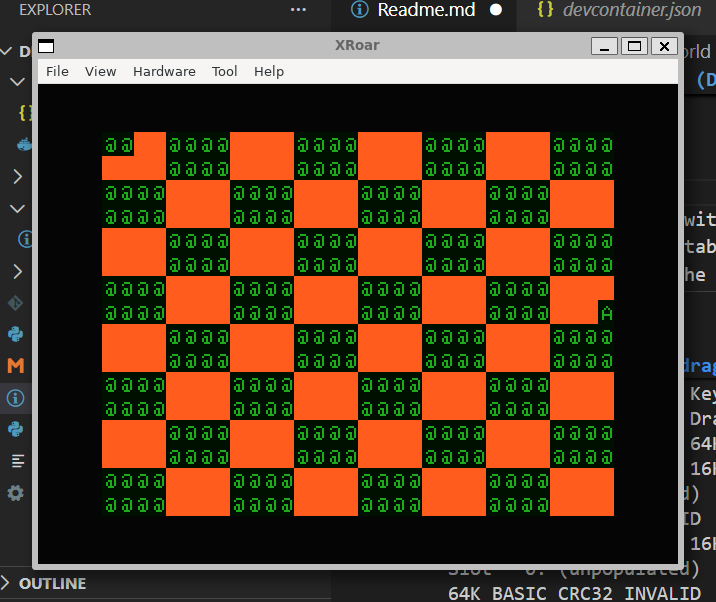

# Dragon 32 Hello World (DevContainer)

This project demonstrates a simple Dragon 32 Assembly program that prints "Hello World" using a ROM cartridge image.


## Pre-requisites
### Dragon 32 Rom image
The DevContainer ships with [XRoar](https://www.6809.org.uk/xroar/) - and to use this a suitable Dragon 32 Rom will be required - Roms should be copied into the roms folder.



xroar can be launched from the command line using `xroar`


## Usage

1. Open in VSCode.
2. Reopen in DevContainer.
3. Build with:
   ```bash
   make
   ```
4. Run the cartridge with:
   ```bash
   make run
   ```
5. Clean the dist folder with:
   ```bash
   make clean
   ```